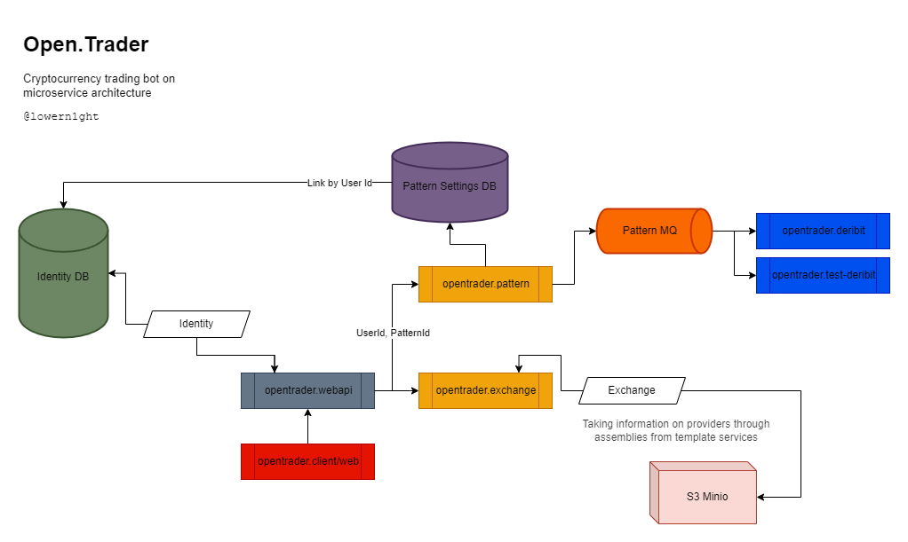

# Open-Trader

`Open source` crypto _bot_ on **micro-services** **architecture** application

## Deploy

> Read this documentation [build documentation](BUILD.md)

## UML Diagram

> Example scheme of the infrastructure that will be used for the development of this application

### Description about _Diagram_

1. **Identity** - Built in web api. I didn't see the need to put it in a separate service
2. **Exchange** - Located in a third-party service and collects information about providers from assemblies 
   of services, when adding a new provider should 
   add a link to the project and specify it in the code proper

### Why is that

1. Single message broker for templates - The message broker forwards a small number of messages to the endpoints. 
But the services themselves are already involved in complex template processing

### Git Decoration

> 
[issues/task](type-commit{fix/bugfix/feature/refactor}): and description
